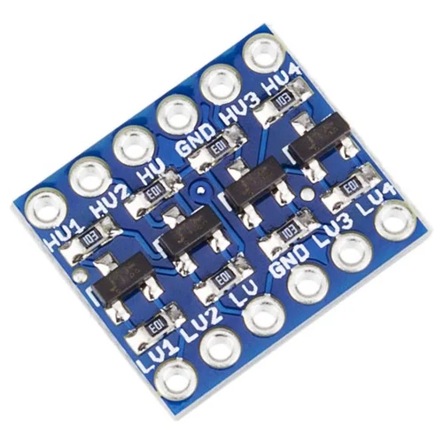
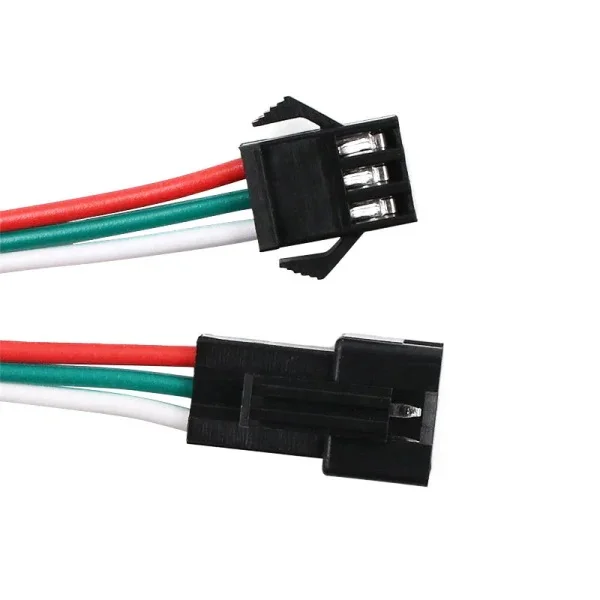
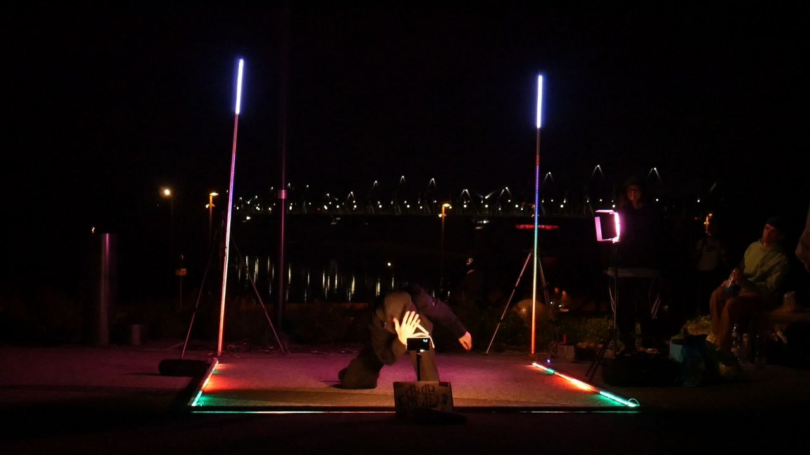

= Light Jam v1

//TODO (Bella Skyway event happened annually in August, and every time it happened I wanted to add on something from myself, but every time I was too late with the idea. Finally, in 2024 exactly one week before the event I decided make something. I knew that there was way too little time to make it perfect, so I had to make something makeshift.)

I used 2 interlocked U shaped aluminium profiles for the frame for each "module". Each profile was 2 meters long. For LED I used 1 strip of TM1814 zip tied along with a milky diffuser. TM1814 are addressable 12V LED, for powering them I used 12V lead acid battery. For control, I used ESP32, but since TM1814 need 5V data signal, and ESP32 is 3.3V based, I had to use a level shifter. I settled for I2C level shifter.

Most connections were soldered, only except for LED connections.

Unfortunately due to constant mechanical stress most of the soldered connections broke, so I had to re-solder at the event place.

For software, I used https://kno.wled.ge/[WLED], which is an open source project for controlling addressable LEDs.

Together I made 6 such modules, 4 of them were connected together to make a square, and 2 were standing on the sides in effect making this setup:

As shown in the picture I used additional 2 (in front, and on the right side) commercial LED lights for additional lightning.

For sound, I used my laptop with Virtual DJ software (on Linux) called https://mixxx.org/[Mixxx].

For music to light synchronization I used https://github.com/LedFx/LedFx[LedFx] software. Since I was on Linux I could simply virtually pass the audio from Mixxx to LedFx.

After Skyway ended I used the same setup for multiple school spectacles like Valentine's Day.

Due to huge technical dept of this version I decided to make a second version called
link:../Light%20Jam²/Light%20Jam².adoc[Light Jam²]