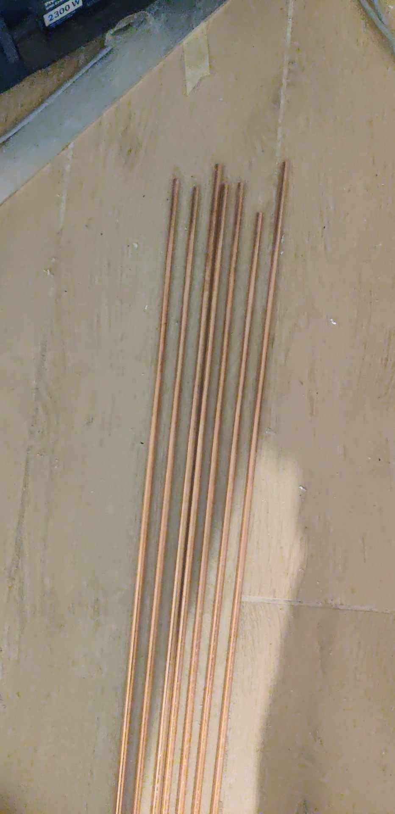

= Light Jam²

It is hard to tell when exactly this version of the project started, but let's say it was when I decided to invest more money and time into making a better version of Light Jam.

So the first investment was buying a 2m by 2m PCV checkered flooring. It was bought for 200 PLN and actually it the one seen in this picture:

The second investment was buying a professional DJ controller, Pioneer DDJ-800. It was a big step up from using a laptop with a mouse and keyboard.

First step in making the new version was making a plan and a 3D design in https://www.blender.org/[Blender]

The design changed a bit over time, but the main idea stayed the same.
In contrast to the first design LEDs were to be mounted on the inside of L shaped aluminium profiles, which was 2.5 meters long. The profiles were to be connected with 3D printed corners.

12 V positive pole was to be passed through the aluminium profile by 2.6 m copper cable, and 12 V negative pole was to be passed through the aluminium profile.

The cable was to be covered by 2 cm wide aluminium flat bar for diagonal LED strips.

Originally I was going to use multiple thin copper wires twisted together, this idea turned out to be a terrible one. Problem was that in order to pass enough current I had to fully fill the triangle made by the aluminium profile, and the diagonal flat bar. I searched for a premade cable, but all of them had either too thick insulation, wasting lots of space, or weren't rated for enough current. Instead of giving up that idea I decided to buy a cable that was rated for enough current, and had too thick insulation, and strip the insulation off, then envelope the cable in heat shrink tubing, which was a lot thinner. After wasting a lot of time and money I finally realized that all of that was way too complicated even if it was possible.

As seen in the design picture, I decided to use a custom diameter (7mm) copper rod, which was to be cut to 2.6 m pieces. This wasn't the cheapest neither the accessible solution, but it was the simplest one.

Around that time I made a stupid mistake of painting the aluminium profiles black way too early in the process. I used a spray paint for aluminium, but it scratched off making it look ugly.

Instead of using TM1814 LED strips again, I decided to use new one may say experimental LED strips LC8816E which are way denser (120 LEDs per meter) therefore brighter, and have better animation resolution. Unfortunately they are a little bit wider, therefore I couldn't use the same configuration as in the first version.

//TODO (picture of one module with all LEDs mounted)

video::Videos/video_2025-09-10_18-57-43.mp4[]
//TODO rename all videos

After first test I was really happy with the brightness and quality of the LEDs.

After that I proceeded to finish rest of the modules. I plan to make 8 modules, 4 of them to be connected in a square, and 2 on each side, plus 2 replacement modules in case of any damage during event.

Mass production

image::Images/Mass hole drilling.jpg[width=200]

//TODO include more finished modules pictures

For better sound quality I bought 2 portable bluetooth speakers, which I placed on the sides of the setup. Soundcore Boom 2

In contrast to the first version, this time I decided to use a new (again experimental) LiFePO4 battery which is way denser in terms of energy storage per weight.
//TODO (picture of new battery and power supply)

New battery has a built-in BMS (battery management system), and a much better connection system. For best connection I bought clamp terminals for the battery.
//TODO picture of battery terminals
//TODO tell about different diameters of positive and negative poles

For control, I decided to use a new Freenove ESP32 board. For audio input I decided to use an ADC (analog to digital converter).
//TODO images of new Freenove esp32 and breakout board + ADC audio converter for WLED moon modules audio reactive

It appeared that for LC8816E LEDs a level shifter is not necessary, but probably it would be a good idea to use one anyway.

For connecting the modules together I decided to use: for data - 4 pin connectors, for power - M6 eyelet connectors

Replication steps:
1. Drill holes for GND 2.7 cm from the end of the profile and 1 cm from the edge. Hole diameter 5 mm
2. Tap the holes
3. Remove excess paint from the inside of the profile, and around the screw holes
4. Glue hex nuts aligned with threads for each hole on the outside
5. Glue in prepared insulated copper rod
6. Glue diagonal panel 2 parts at 45° angle
7. Glue 4 LED strips - 2 on diagonal panel + 1 on each side of the profile

To prepare independently:
Copper rod tapped 1 cm at each end, insulated
Eyelet ended LED cables: 4 GND double ended, 2 VCC quadruple ended

//TODO battery powers DJ controller via 12V DC-DC converter (battery voltage can vary from 15V to 5V, while DJ controller needs constant 12V), also ESP32 directly connected to battery thanks to built-in voltage regulator in breakout board

Future plans:

* Make cutout from PVC transparent pipe diffuser for LEDs, held by 3D printed clips, diffusing using thin layer of paper.

* Buy a wheelbarrow for easier transport? or make a custom trolley? or finally get a driving license.

* Make 3D printed version of the logo (metal screw for better durability)

Advertisement:

Since technical side of the project is mostly done, people coming to the event are now the main priority. My friends helped me in making a instagram page
