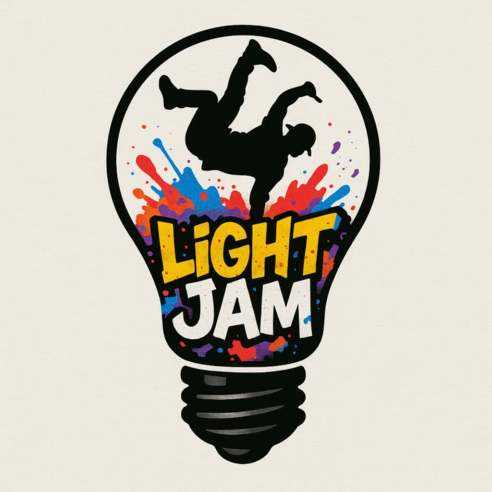

= Light Jam

Shortly: A lightweight, portable, modular LED sound reactive lightning setup

First idea of making this project was inspired by light show in Toruń called https://bellaskyway.pl/en/[Bella Skyway]

First version of this project was made in 2024 in about 3 days.

* link:Light%20Jam%20v1/Light%20Jam%20v1.adoc[Light Jam v1]

After a huge success of the first version I decided to make a second, more professional version of this project called:

* link:Light%20Jam2/Light%20Jam2.adoc[Light Jam²]

In case the project lives long enough, I plan to make a third version of this project called: Light Jam³/!Light Jam/Light Jam ∞
